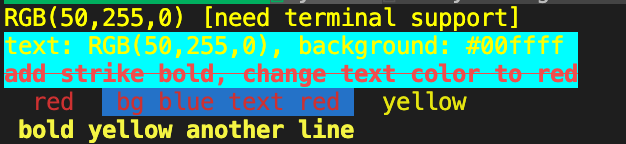

# Terminal Effect Text

## Introduction
Terminal effect text made easy. color log and everything you need.

a simple wrapper of [SGR (Select Graphic Rendition) parameters](https://en.wikipedia.org/wiki/ANSI_escape_code)

some parameter are not support by some terminal, see details in https://en.wikipedia.org/wiki/ANSI_escape_code

## Usage
1. install
```bash
npm install terminal-text-effect #npm
yarn add terminal-text-effect #yarn
```
2. code
```js
import { EffectedTerminalText as ett } from "terminal-text-effect";

let effect = ett.newEffect().setForegroundColorByRGB(255, 255, 0);

console.log(effect.parse("RGB(255,255,0) [need terminal support]"));

effect.setBackgroundColorByRGBHex("#00FFFF");

console.log(effect.parse("text: RGB(50,255,0), background: #00ffff "));

console.log(
    effect.strike().bold().red().parse("add strike bold, change text color to red")
);

let effect1 = ett.newEffect();

effect1
    .red().bufferToPrint("red")
    .backgroundColorBlue().bufferToPrint("bg blue", "text red")
    .reset().yellow().bufferToPrint("yellow")
    .commitPrint()
    .bold().print("bold yellow another line");
```


## CommonJs or ESM
```js
//commonjs
const ett = require("terminal-text-effect") 
//typescript and esm
import ett from "terminal-text-effect"; 
//or
import {EffectTerminalText as ett} from "terminal-text-effect";
```

## What's more
Little project, have a nice day~